---

title: Docker - Parte 1

abstract: Desde hace muchos años el desarrollador de sofware ha venido absorviendo lentamente la configuracion de despliegue de una aplicacion a los diferente ambientes del pipeline de delivery. Docker es nuestra toolkit

categories: Docker

keywords: Docker, CD, CI, Devops

weblogName: Wordpress

postId: 63

---

<!-- $theme: gaia -->

[TOC]

___

# Docker

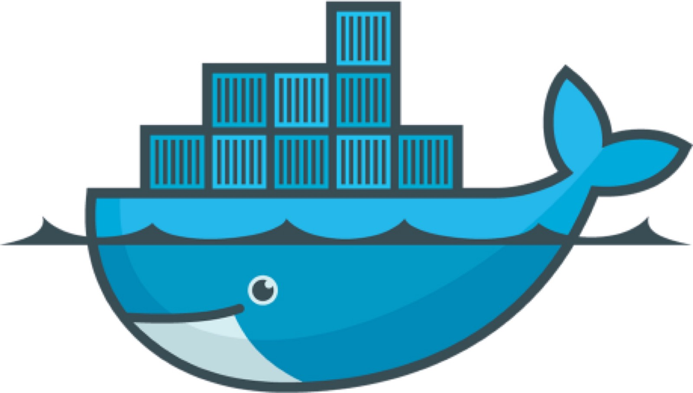

___

## Objetivo del taller

Desde hace muchos años la virtualizacion de los sistemas operativos optimizó la manera de instalar, probar y correr ambientes sin la necesidad de tenerlos instalados directamente en equipo.

* Mayor versatilidad al componente duro (hardware)

* Simplicidad

* Escalamiento simple
___

### Lo que Nos Ofrece

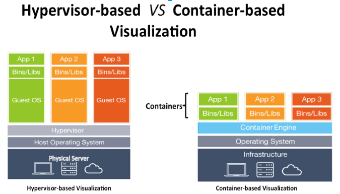

___

### Bueno eso se revoluciono!!

___

### Su Filosofia

Si java nos dice

>"Write once run anywhere"

Docker nos dice

>"Build, Ship, and Run Any App, Anywhere"

Ojo aqui :eye:  **Anywhere!!!**

* raspberrypi, arduino, clouds, servers, ¿mobiles?

___

### La automazacion de Infraestructura

La idea básica detrás de Docker es empaquetar una aplicación con todas sus dependencias en una única unidad estandarizada para el desarrollo y despliegue de software.

Código --> Binario compilado --> Depoyado 

= Imagen Docker

___

Lo que necesitamos para desarrollar una aplicacion (minimamente)

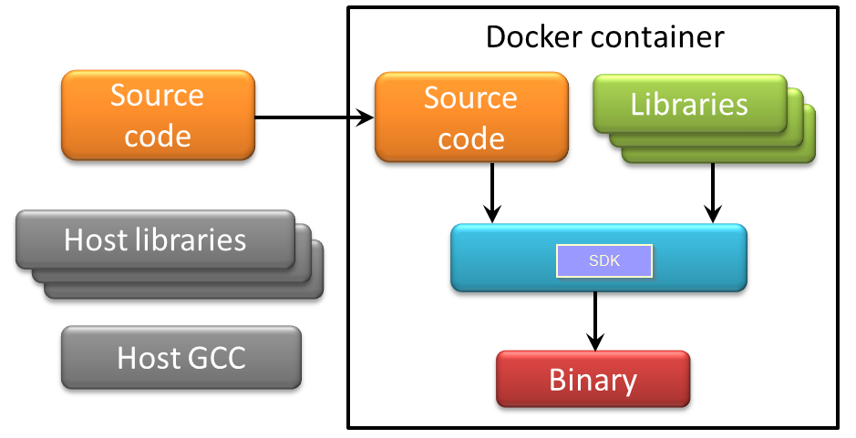

___

### Usaremos Docker en el desarrollo

La intencion de usar contenedores de Docker es envolver un aplicativo en un filesystem completo que contenga todo lo que necesita parar su exitosa ejecucion: 

* Código fuente compilado

* Librerias de runtime

* Herramientas del sistema operativo

* Librerias propias del sistema opertivo.

___

Con Docker, puede construir un proyecto Node.js o Java (o python o lo que sea) sin tener que instalar dichos SDK's en tu máquina host. 

Una vez que hayas terminado, puedes destruir la imagen de Docker, y es como si nada hubiera pasado.

___

### Para la industria

De profundo interes al sector industrial del software docker ayuda de manera agnostica a agilizar el proceso de adminstracion de ambiente y entrega del aplicativo.

De tal forma que se alcanze un flujo continuo del desarrollo, la integracion de cambios y despligues.

___

### En terminos más técnicos

CI + CD

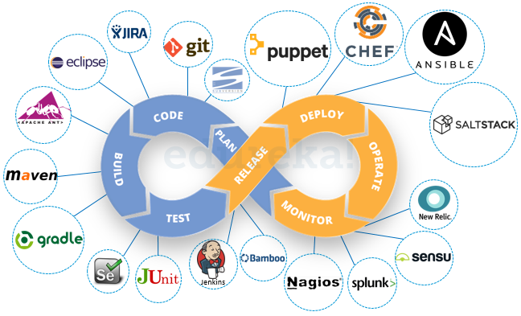

* De manera general docker ayuda al CD

___

### Docker NO es un lenguaje de programación

Docker tampoco es un framework

Veamoslo como una herramienta que te ayuda a resolver problemas comunes tales como Instalar, distribuir y administrar tu entregable.

**Docker Permite a los programadores Construir, distribuir y Ejecutar su aplicativo en cualquier lugar.**

___

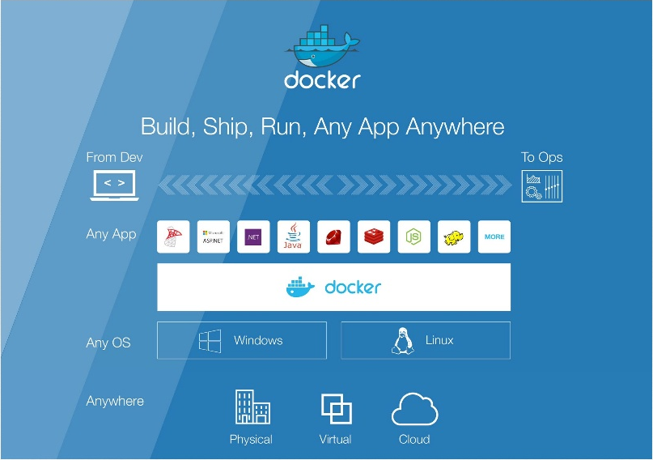

___

Con docker se tenemos un primer acercamiento al paradigma *Infrastructure as code*

* a veces las personas se preguntan que es mejor usar: ¿¿vagrant o docker??
	+ Realmente no son tecnologias en mutua competencia
	+ Por el contrario se usan en colaboracion pues son inclusives

___

## Instalacion

[Docker Oficial](https://www.docker.com/)

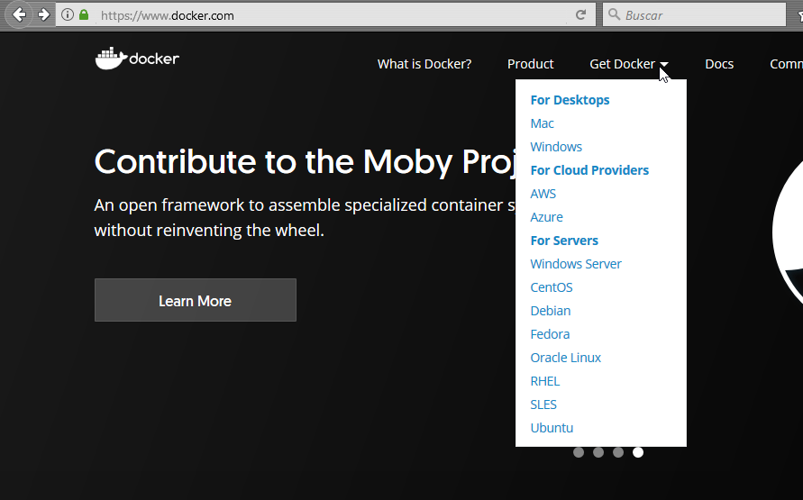

___

### Los componentes de docker

Cuando instalamos docker, se configuran sus 3 componentes funcionales

* El engine (expuesto en servicio REST)

* El cliente (un cliente en linea de comandos)

* El servicio en modo deamon

___

### Kitematic

Opcionalmente existe kitematic, un cliente GUI de docker que nos simplifica bastante la operacion con docker

[Kitematic](https://kitematic.com/)

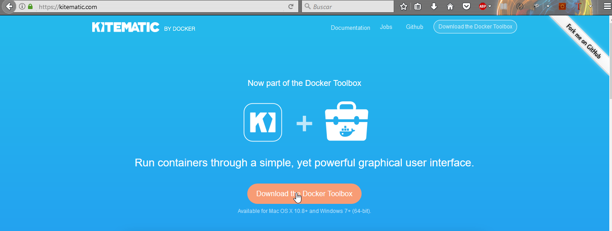

___
### Vamos Jugando y Aprendiendo

[http://training.play-with-docker.com/alacart/](http://training.play-with-docker.com/alacart/)

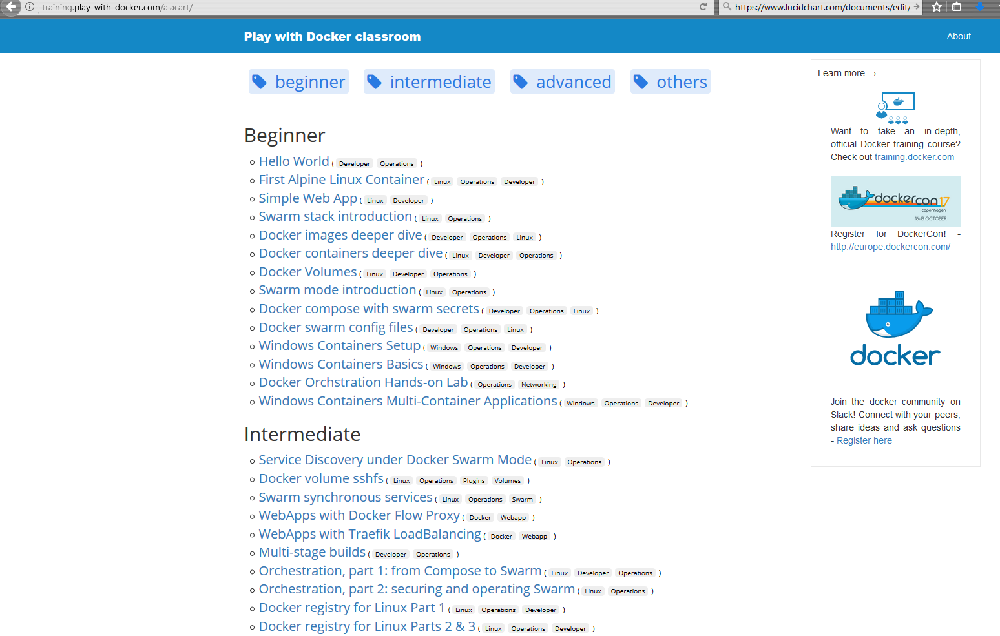
___

## Conceptos Importantes

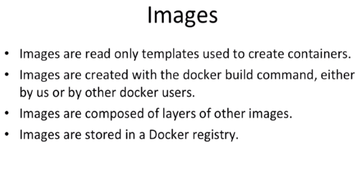

___

### Image = n Layers (read only mode)

Una imagen es una pila de layers de un mismo filesystem en modo solo lectura y que docker se encarga de hacer el merge al momento de levantar el contenedor

___
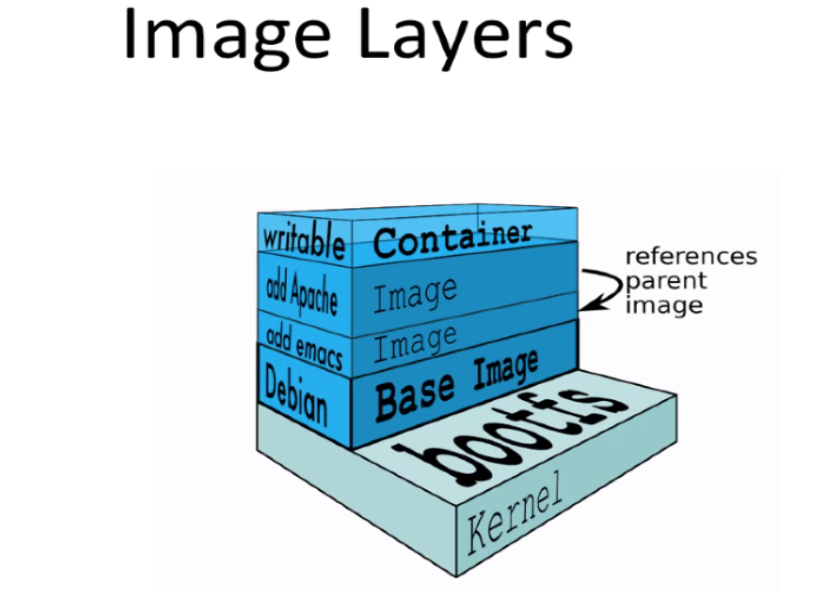
___
### ¿¿Que ocurre ocurrio??

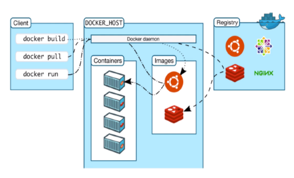

___

### El DockerFile

Define los pasos de nuestra receta de creacion de imagenes
___
### Algunas Instrucciones

La 1er Instruccion Valida siempre es un FROM

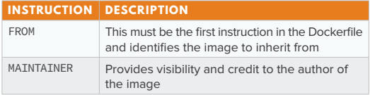

___

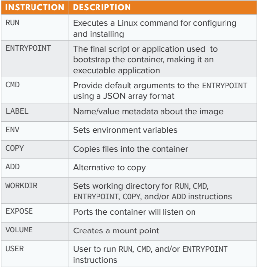
___

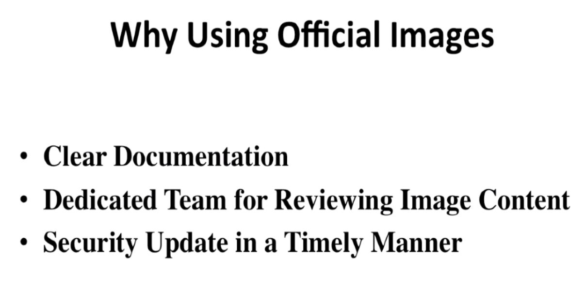
___

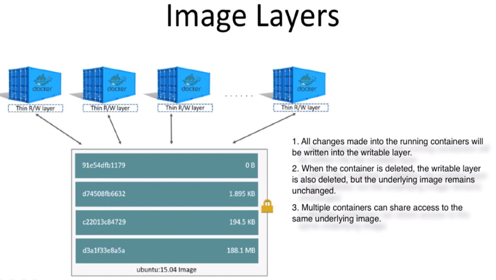
___

### Contenedor

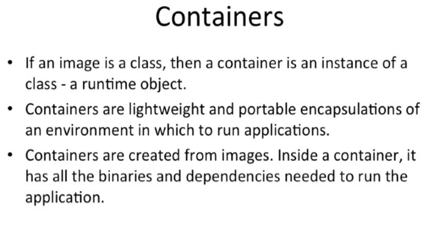

___

### ¿Imagen Y contenedor? Cual es la diferencia

* Un contenedor es ligero, requiere de ram para ejecutar
* Una imagen es pesada requiere almacenamiento

___

### Registry

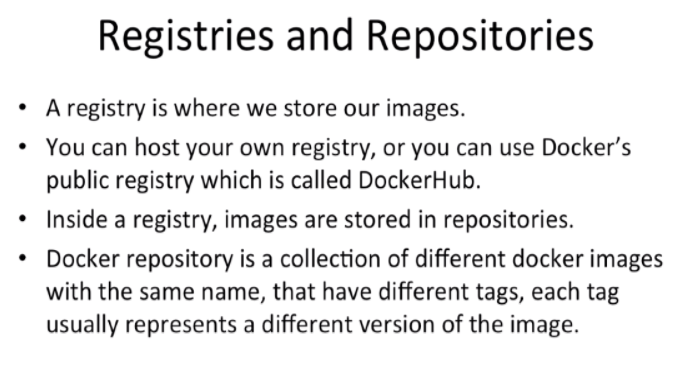

___

### Docker Hub (Public Repository)

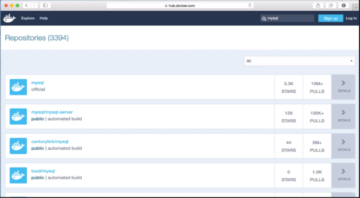

**[https://hub.docker.com/](https://hub.docker.com/)**
___

## Laboratorio

### Practica 1

A continuacion un ejemplo propio para ver como se  realiza una imagen
___
### Prerequisitos
Para este laboratorio es necesario tener los siguientes clientes/programas instalados localmente

	0.1.- Crear cuenta en docker cloud
	0.2.- Instalar Docker
	0.3.- Instalar git
	0.4.- Instalar Maven
	0.5.- Instalar Jenkins (recomiendo con choco package manager)

___
### Pasos a seguir

Vamos hacer un sencillo workflow de los que podemos trabajar con docker en nuestro dia a dia.

1.- clona tu  repositorio:

>git clone https://github.com/sidlors/ajax4jsf.git

2.- Compilacion, debemos generar el war asociado a este codigo

>mvn clean compile install -Dmaven.test.skip=true
___
3.- Creamos la imagen asociada a nuestro codigo

>docker build . -t sidlors/ajax4jsf-demo  --force-rm --no-cache

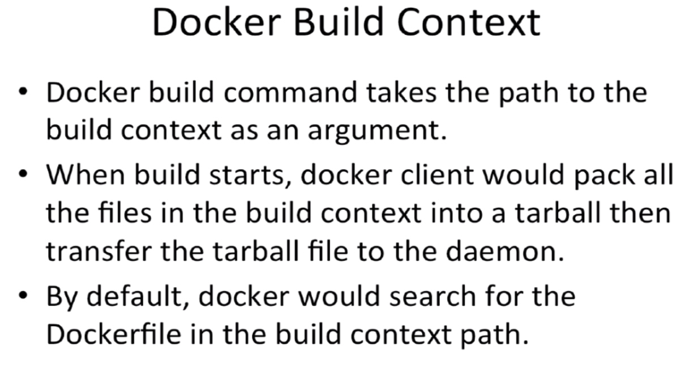
___
4.- Corremos un contenedor basado en la imagen preconstruida

>docker run -d --name mydemo -p 8080:8080 sidlors/ajax4jsf-demo
___
5.- Probamos localmente que la instancia este funcionando correctamente,

http://localhost:8080/ajax4jsf/welcome.faces

___

6.- Vamos a dar de alta en docker cloud el repositorio que alacenara la imagen creada anteriormente

___
7.- Vamos a hacer push a la imagen

>docker image push sidlors/ajaxjsf-demo

*Nota como es que las capas en docker cloud se reciclan*

___

### Que sigue?

Bien ahora lo que continua es

+ Conocer el Dockerfile y sus posibilidades
+ Cuales son las _best practices_
+ Crear mas de un contenedor y enlazarlos
+ ¿Como se combiana esto con los microservicios?
	+ Deployar en nube
	+ Automatizar la construccion
	+ Hacer un versionado de las imagenes
___
+ Hacer un aplicativo SaS 
	* https://github.com/sidlors/Data-Science-and-Machine-Learning.git
	* https://hub.docker.com/r/amancevice/caravel/ 

___
### Referencas sugeridas

[Docker Dzone RefCardz](https://dzone.com/refcardz/getting-started-with-docker-1)

[Seguir jugando en  play with Docker](http://training.play-with-docker.com/)

[Una presentacion muy buena](https://www.slideshare.net/sgganesh/docker-by-example)

[Libro Painless Docker](https://scanlibs.com/painless-docker-basic-edition/)

[Curso en español de Udemy](https://www.udemy.com/integrando-docker-a-su-infraestrucutra-y-servicios/)

[Libro Docker for data science](https://scanlibs.com/docker-data-science/)

[Como usan docker play para aprender Kong API Manager](https://www.youtube.com/watch?v=ayNLGfSHGFk&feature=youtu.be)

