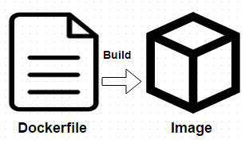

<!-- $theme: gaia -->

[TOC]
___

# Docker

___

## Objetivo del taller

Desde hace muchos años la virtualizacion de los sistemas operativos optimizó la manera de instalar, probar y correr ambientes sin la necesidad de tenerlos instalados directamente en equipo.

* Mayor versatilidad al componente duro (hardware)
* Simplicidad
* Escalamiento simple
___
### Bueno eso se revoluciono!!

___

### Si la filosofia de java fue

>"Write once run anywhere"

### La filosofia de docker es

>"Build, Ship, and Run Any App, Anywhere"

Ojo aqui :eye:  **Anywhere!!!**

* raspberrypi, arduino, clouds, servers, ¿mobiles?
___

Lo que necesitamos para desarrollar una aplicacion (minimamente)

___

La idea básica detrás de Docker es empaquetar una aplicación con todas sus dependencias en una única unidad estandarizada para el desarrollo y despliegue de software.

Código --> Binario compilado --> Depoyado 

= Imagen Docker

___

### Utilidad en el desarrollo

La intencion de usar contenedores de Docker es envolver un aplicativo en un filesystem completo que contenga todo lo que necesita parar su exitosa ejecucion: 

* Código fuente compilado
* Librerias de runtime
* Herramientas del sistema operativo
* Librerias propias del sistema opertivo.
___

### Se  nos acabo la vieja confiable

___

Con Docker, puede construir un proyecto Node.js o Java (o python o lo que sea) sin tener que instalar dichos SDK's en tu máquina host. 

Una vez que hayas terminado, puedes destruir la imagen de Docker, y es como si nada hubiera pasado.

___

### Para la industria

De profundo interes al sector industrial del software docker ayuda de manera agnostica a agilizar el proceso de adminstracion de ambiente y entrega del aplicativo.

De tal forma que se alcanze un flujo continuo del desarrollo, la integracion de cambios y despligues.

___

### En terminos más técnicos

CI + CD

* De manera general docker ayuda al CD

___

### Docker NO es un lenguaje de programación

Docker tampoco es un framework

Veamoslo como una herramienta que te ayuda a resolver problemas comunes tales como Instalar, distribuir y administrar tu entregable.

**Docker Permite a los programadores Construir, distribuir y Ejecutar su aplicativo en cualquier lugar.**

___

Si la filosofia de java es

> "Write once run anywhere" *

La filosofia de docker es

> "Build, Ship, and Run Any App, Anywhere"

Con docker se tenemos un primer acercamiento al paradigma *Infrastructure as code*

___
## Instalacion

[Docker Oficial](https://www.docker.com/)

___
### Los componentes de docker

Cuando instalamos docker, se configuran sus 3 componentes funcionales

* El engine (expuesto en servicio REST)
* El cliente (un cliente en linea de comandos)
* El servicio en modo deamon

___

### Kitematic
Opcionalmente existe kitematic, un cliente GUI de docker que nos simplifica bastante la operacion con docker

[Kitematic](https://kitematic.com/)

___
## Conceptos Importantes
### Imagen

Una imagen Docker es como un snapshot de una máquina virtual, pero mucho más ligera.

La "best practice" es la de crear  una imagen a partir de otra ya existente aprovechando que existe un repositorio público de imágenes ya creadas que nos pueden ser útiles para este fin.

___
### El DockerFile

Define los pasos de nuestra receta de creacion de imagenes

___

### Contenedor
Si pudieramos hacer una analogia practica sencilla seria la siguiente

Si el objeto es una instancia de una clase
 -> El contenedor seria de la misma forma la instancia de una imagen

___

### Registry
___
## Hola Mundo

___
## Laboratorio

### Lecturas obligadas

[Una presentacion muy buena](https://www.slideshare.net/sgganesh/docker-by-example)